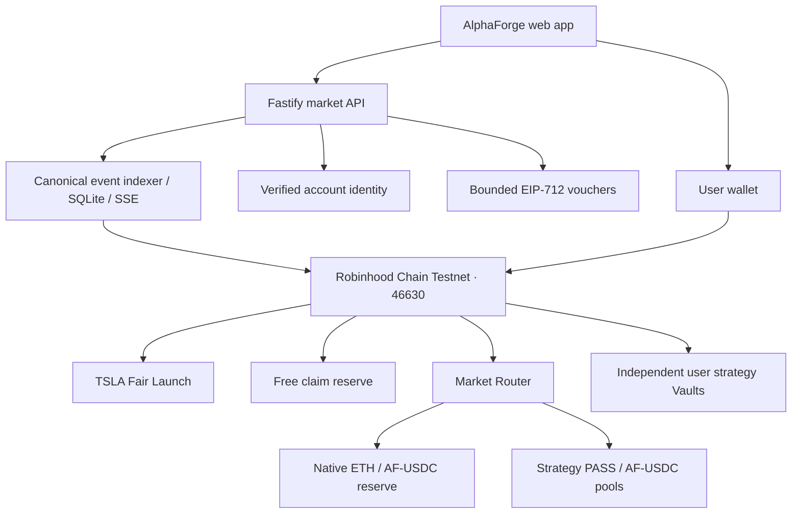

# AlphaForge

**A strategy access market with native ETH trading and isolated user Vaults.**

[Open the app](https://www.ikol.top/alphaforge/) · [Deployment guide](docs/fair-launch/DEPLOYMENT.md) · [Test evidence](docs/fair-launch/TESTING.md) · [Security policy](SECURITY.md)

AlphaForge connects strategy access rights, a shared on-chain market, and user-controlled capital. Each strategy has a fixed-supply PASS token. Users can subscribe to a new strategy, trade PASS through a common market design, and lock PASS to unlock capacity in their own strategy Vault.

The Hackathon edition targets **Robinhood Chain Testnet, chain ID 46630**. All market settlement uses ERC-20 assets or native test ETH. Accounts and verified email identities stay off-chain; the database stores projections and audit records, while contracts remain authoritative for assets and funds.

```text
Claim AF-USDC → Mint TSLA / Buy PASS → Hold → Use Vault → Sell PASS → Receive ETH
```

> **Release status — October 10, 2026:** This checkout includes the Fair Launch implementation, local EVM scenarios, and scoped reviews delivered through [PR #47](https://github.com/pdbsy/Alphaforge/pull/47). The website is published and target-network deployment is in progress. Complete market activation and real user Testnet acceptance remain pending. Historical test reports identify the source commits they validate; they are not production audit certificates.

## Contents

- [Two strategies](#two-strategies)
- [Core capabilities](#core-capabilities)
- [Architecture](#architecture)
- [Getting started](#getting-started)
- [Local EVM testing](#local-evm-testing)
- [Testnet deployment](#testnet-deployment)
- [Configuration and recovery](#configuration-and-recovery)
- [Repository layout](#repository-layout)
- [Documentation](#documentation)
- [Contributing](#contributing)
- [Security and asset boundaries](#security-and-asset-boundaries)

## Two strategies

| | All in TSLA | All in AMZN |
| --- | --- | --- |
| PASS supply | 1,000,000, minted once | 1,000,000, minted once |
| Initial distribution | 500,000 public Mint; 500,000 reserved for LP | 500,000 in the initial pool; 500,000 allocated to the approved wallet |
| Initial pricing | Public Mint at 0.5 AF-USDC / PASS | Initial pool reference of 0.5 AF-USDC / PASS |
| Initial liquidity | 500,000 PASS + 250,000 AF-USDC, escrowed before Mint opens | 500,000 PASS + 250,000 AF-USDC, labeled test initialization liquidity |
| Market lifecycle | Minting → automatic launch → live trading | Secondary trading after verified initialization |
| Vault target | TEST TSLA | TEST AMZN |

TSLA's final successful Mint creates its pool and enables trading **in the same transaction**. If pool initialization fails, that Mint, its payment, and the inventory change all revert. Subscription proceeds go to the designated recipient; independently funded LP assets are already held by the launch contract. No administrator signature is needed after sellout.

Once a pool is live, PASS prices follow its actual reserves and trades. The initial 0.5 reference is not a permanent execution price. PASS prices and stock reference prices are separate: the Mint UI shows TSLA issuance progress, and stock charts provide a distinct view of the corresponding strategy target.

## Core capabilities

- **Fixed supply and exact amounts.** AF-USDC uses six decimals; PASS and native ETH use eighteen. Settlement uses integer units. Each strategy's PASS supply is fixed after deployment.
- **One market price per strategy.** The same constant-product AMM implementation serves independent PASS/AF-USDC pools. The 0.30% swap fee accrues to pool liquidity under the contract's rules.
- **Native ETH in both directions.** Buy and Sell default to test ETH. A separate ETH/AF-USDC conversion reserve connects that route to the same PASS pool. Users can also choose AF-USDC. Conversion and market settlement are atomic.
- **Bounded free test credits.** Up to 100 verified accounts can claim 1,000 AF-USDC each from a separately funded 100,000 AF-USDC reserve. Account-bound vouchers, persistent eligibility, and on-chain replay protection prevent repeat claims after wallet changes or restarts. Email verification does not eliminate multi-account abuse.
- **User-owned Vaults.** Locking 1 PASS supports 1 AF-USDC of principal capacity. Eligible realized cash profit is withdrawn first; principal exits release corresponding PASS. Losses do not automatically release locked capacity. Full closure follows position-settlement and remaining-PASS rules.
- **Restricted strategy execution.** Each Vault permits only its assigned TEST stock, with owner/executor authorization, order limits, slippage, deadlines, fresh references, and market-session checks.
- **A shared, recoverable market.** A canonical event indexer tracks transfers, subscriptions, swaps, claims, conversions, and Vault activity. SSE updates all clients; durable projections support replay, reconnects, and reorg recovery.
- **Wallet-confirmed transactions.** A submitted hash is pending evidence. Completion requires matched successful chain execution and the configured confirmation policy: three L2 blocks including the inclusion block. This is not L1 finality.

## Architecture



The server reads chain state and signs narrowly scoped quotes or claim credentials. User wallets authorize and broadcast their own asset transactions. Voucher signers have no administrator transaction capability.

Funds have separate owners and reserves: public subscription proceeds, TSLA LP, AMZN LP, free claims, conversion liquidity, user wallets, and user Vaults. Vault principal cannot fund liquidity or ETH payouts. An unavailable ETH route rejects the transaction; it never silently changes the user's chosen output to AF-USDC.

## Getting started

### Prerequisites

- **Node 24.21.0** from [.node-version](.node-version).
- **npm 11.19.1** from [package.json](package.json).
- Git with complete project history for provenance checks.
- The contract checks below additionally require **CPython 3.12.9** and the repository's pinned Solidity tooling.

Use the [toolchain guide](docs/DEVELOPMENT-TOOLCHAIN.md) together with its [implementation status](docs/DEVELOPMENT-TOOLCHAIN-STATUS.md). Dependency versions and lifecycle-script restrictions are part of the build inputs; retain the committed lockfile.

```bash
git clone https://github.com/pdbsy/Alphaforge.git
cd Alphaforge
node tools/check-environment.mjs
npm ci --ignore-scripts
```

### Local product preview

```bash
npm run demo
```

Open **http://127.0.0.1:4180**. This command builds the maintained UI and runs the legacy local simulator with [.env.example](.env.example). Its balances are simulated, and it does not deploy or fund the Testnet market. Local runtime data lives under the ignored `.data/` directory.

### Market service

Copy [the market environment example](deploy/launch-market/.env.example) to a private configuration file. Set the approved origin and a private data directory, then launch with that file explicitly:

```bash
node --env-file=/absolute/private/market.env tools/launch-market/server.ts
```

The service binds to loopback on port **4101** by default. It does not automatically load the deployment example. Leaving `AF_MARKET_MANIFEST` unset exposes `NOT_DEPLOYED` and disables asset operations. To activate a real market, follow the deployment guide with a verified manifest, RPC connection, existing verified-account service, and separate voucher signers.

## Local EVM testing

The market's isolated EVM harness deploys real contracts and uses real local transactions, receipts, and events. It exercises Alice and Bob against a shared pool, free claims, subscription, ETH/AF-USDC buy and sell, Vault locking and withdrawals, the last TSLA Mint, and recovery. Identity and market-data inputs are explicitly labeled offline fixtures.

The commands below follow the **Linux x64** pinned harness. The Anvil bootstrap currently supports that platform; other host profiles need their own qualified tooling. Tool bootstrap downloads fixed, hash-checked artifacts into ignored project-local directories.

```bash
python3.12 contracts/script/bootstrap.py
python3.12 -c "import runpy; runpy.run_path('contracts/script/pinned_dependency.py')['prepare']()"
cd contracts
../.checks/af-chain01/toolchain/bin/forge test --offline --match-path 'test/{market,launch-vault}/*.t.sol'
cd ..
npm run fair-launch:artifacts
npm run test:fair-launch:artifacts
node tools/launch-market/bootstrap-anvil.mjs
npm run test:fair-launch:evm
```

Use focused application checks while developing:

```bash
npm run typecheck
npm run test:fair-launch
npm run build:web
```

| Command | Scope |
| --- | --- |
| `npm run test:fair-launch:wallet-receipts` | Local 41-step deployment and receipt-verification rehearsal |
| `npm run test:fair-launch:browser-evm` | Browser, API, wallet bridge, and local EVM; requires a web build and separately qualified browser tools |
| `npm run test:fair-launch:load` | Separate 30-minute shared-market load harness with 100 SSE clients and 20 active test wallets |
| `npm run check` | Full repository checks, including historical modules and governance |

Historical source-admission checks need their retained Git references and qualified CI context. A local clone alone does not grant historical approval; use the focused checks above for routine development.

The [test report](docs/fair-launch/TESTING.md) records actual outcomes, source references, failed runs, and remaining external checks. Local EVM success does not establish target-network deployment, public RPC performance, or live identity/feed availability.

## Testnet deployment

Only **Robinhood Chain Testnet / 46630** is supported for this rollout. Native test ETH pays gas and serves the ETH settlement route. AF-USDC and TEST stocks are test assets with no promised real-world redemption.

Deployment has separate preparation and execution stages:

1. Explicitly configure asset supply, reserves, LP recipients, administrator, voucher signers, and ETH limits.
2. Build an unsigned transaction plan and run read-only preflight.
3. Review and sign the approved transactions through the designated wallet.
4. Verify actual canonical receipts, contract runtime hashes, allocations, pool reserves, and permissions.
5. Activate the market service with the resulting verified manifest, then run genuine user-wallet acceptance.

```bash
# Reads approved inputs and artifacts; does not sign, broadcast, or change chain state.
npm run fair-launch:prepare -- /absolute/private/approved-inputs.json /absolute/private/new-unsigned-plan.json

# Read-only check; does not authorize deployment.
npm run fair-launch:target-preflight -- --wallet PUBLIC_WALLET_ADDRESS
```

The preparation tool refuses to overwrite an existing output. Re-running preparation does not mint assets or initialize pools. Preserve the reviewed CREATE order, wallet nonce sequence, and durable transaction journal; check uncertain results against the chain before retrying.

The separate [deployment page](https://www.ikol.top/alphaforge/deployment.html) guides the approved personal-wallet sequence. **Start remaining steps** requests transactions one at a time and checks confirmations between them; each transaction still requires approval from the designated wallet. This page is an operator workflow, separate from ordinary product usage.

The approved starting configuration is documented in [the rollout record](docs/fair-launch/GO-LIVE.md): 2,000,000 AF-USDC total supply and 0.002 native test ETH for conversion liquidity, with finite output budgets. This small starting reserve does not guarantee ETH settlement for every tester at once. Authorization, successful deployment, and completed Testnet acceptance are distinct states.

See [deployment and permissions](docs/fair-launch/DEPLOYMENT.md) and [personal-wallet verification](docs/fair-launch/reviews/PERSONAL-WALLET-ROLLOUT.md). Their observations are dated; later rollout records supersede earlier authorization snapshots.

## Configuration and recovery

| Setting | Purpose |
| --- | --- |
| `AF_MARKET_ORIGIN` | Approved browser origin for authenticated operations |
| `AF_MARKET_PORT` | Loopback service port, default 4101 |
| `AF_MARKET_DATA_DIR` | Private durable market data and account/claim registry |
| `AF_MARKET_WEB_ROOT` | Built web assets |
| `AF_MARKET_MANIFEST` | Verified deployment identities, blocks, and runtime hashes |
| `AF_MARKET_RPC_URL` | Target-chain read-only RPC |
| `AF_ACCESS_IDENTITY_SOCKET` / `AF_ACCESS_IDENTITY_DB` | Exactly one existing verified-identity transport |
| Quote/claim signer file settings | Separate private, offline EIP-712 capabilities; see the environment example |

ETH reference validation uses independent Coinbase and Kraken sources, with a 30-second data-age limit and 2% maximum deviation in the initial configuration. Quotes have bounded expiry and chain/domain/user/nonce binding. If a fresh ETH reference cannot be obtained, new ETH quotes stop; viable AF-USDC trading remains independent.

TEST-stock execution has a separate price and trading-session boundary, using read-only reference data and calendar checks. Stock position PnL is calculated from strategy assets, not the PASS market price. The UI distinguishes stock references, initial PASS references, and indexed market trades.

Stock charts refresh Nasdaq display quotes every 15 seconds while visible. Vault execution instead uses separately authorized Alpaca references and market calendars. A displayed quote does not authorize an on-chain stock trade.

Back up the complete private account/claim registry as well as the canonical event store. Chain replay can reconstruct projections; it cannot reconstruct private verified-email mappings or previously issued pending vouchers. Restoring an empty registry would invalidate the repeat-claim protections. Follow [storage backup and recovery](docs/fair-launch/STORAGE.md); never reset users or claim eligibility to resolve a deployment issue.

## Repository layout

```text
apps/web/                 Product UI, market client, wallet flow, deployment page
apps/server/              Existing API, local preview, and identity integrations
packages/launch-market/   Market state, exact math, persistence, chain reads, projections
packages/chain-adapter/   Transaction lifecycle, RPC, manifests, and reconciliation
packages/robinhood-chain/ Target-network metadata and guards
packages/domain/          Exact money and legacy Vault state machine
contracts/src/market/     Fair Launch, AMM, native reserve, Router, claim reserve
contracts/src/launch-vault/ User strategy Vaults and TEST-stock reference components
contracts/deployment/     Reviewed ABI and artifact metadata
tools/launch-market/      Server, local EVM fixtures, preparation, verification, recovery
deploy/launch-market/     Environment and service/ingress examples
test/                     Application and integration tests
docs/fair-launch/         Deployment, delivery, reviews, and source-bound test evidence
```

The maintained product entry is `apps/web/index.html` → `apps/web/src/product-ui.ts`. Existing UI assets and design conventions are retained rather than replaced with a separate demo application.

## Documentation

| Topic | Guide |
| --- | --- |
| Market implementation and delivery scope | [Fair Launch delivery](docs/fair-launch/DELIVERY.md) |
| Test results and limitations | [Testing](docs/fair-launch/TESTING.md) |
| Deployment parameters and permission matrix | [Deployment](docs/fair-launch/DEPLOYMENT.md) |
| Approved rollout configuration and activation | [Go-live record](docs/fair-launch/GO-LIVE.md) |
| Wallet deployment and receipt recovery | [Personal-wallet rollout](docs/fair-launch/reviews/PERSONAL-WALLET-ROLLOUT.md) |
| Persistent state and backup/restore | [Storage](docs/fair-launch/STORAGE.md) |
| Chain adapter and confirmation model | [M3 chain adapter](docs/M3-CHAIN-ADAPTER.md) |
| Network identity | [Robinhood Chain](docs/ROBINHOOD-CHAIN.md) |
| Build tools and supported environments | [Toolchain status](docs/DEVELOPMENT-TOOLCHAIN-STATUS.md) |
| Security reporting | [Security policy](SECURITY.md) |
| Historical management evidence | [Control Center operations](docs/management/dashboard/README.md) |

Historical planning and migration documents preserve the assumptions and results of their own checkpoints. Read their dates and source identifiers before treating them as current release status.

## Contributing

Use an isolated checkout and a task branch. Keep the exact toolchain, committed dependency lock, existing design system, and permission boundaries. Run checks for the modules you change; CI retains the repository's required checks. Include reproducible validation and any `NOT_RUN` items in the pull request.

Retain the frozen Fair Launch source branch and historical references used by provenance checks. Start subsequent work on a new branch; deleting or advancing those source references requires a corresponding reviewed provenance update.

For contract or funds-flow changes, describe amounts in integer units, identify the actual asset owner and signer, and provide scoped independent review. Do not replace chain settlement with database balances or silently change PASS supply, LP ownership, or Vault authority.

Report ordinary bugs through [GitHub Issues](https://github.com/pdbsy/Alphaforge/issues). Use [SECURITY.md](SECURITY.md) for vulnerability reporting.

## Security and asset boundaries

- Use only authorized test assets on chain 46630. This edition does not perform real stock brokerage trades or mainnet settlement.
- Never commit private keys, recovery phrases, `.env` files, account databases, or provider credentials. Environment examples contain configuration names and public metadata, not working credentials.
- Keep deployment/admin keys separate from quote and claim signers. An email session does not authorize wallet asset movements.
- Respect reserve limits, exact approvals, pause controls, and minimum-output protection. Insufficient liquidity causes a failed atomic transaction, not deferred payment.
- Completed local tests and scoped source reviews do not constitute a production security audit. Full target-network acceptance and separately identified security/governance work remain outstanding.

## License and third-party notices

A repository-wide open-source license has not been declared. Vendored libraries and imported assets retain their own notices; see the [LEAN EMA attribution](third_party/lean-ema/README.md) and the [OpenZeppelin license](contracts/licenses/OpenZeppelin-LICENSE).

## Governance baseline

The following preserved section records the original Phase One governance boundary and its independent acceptance requirements. Its closed write planes refer to that legacy baseline; the specifically approved Fair Launch rollout uses the separate procedures above. No README update converts historical reviews into current approval.

## Current work

Governance decision status: **independent review (not accepted)**.

The canonical plan is [planning/roadmap.json](planning/roadmap.json). It generates [TODO.md](TODO.md), the [Markdown board](docs/TASK-BOARD.md) and the standalone [Chinese HTML security board](docs/task-board.html), so CI can reject status drift. Network assumptions and authoritative references are documented in [docs/ROBINHOOD-CHAIN.md](docs/ROBINHOOD-CHAIN.md). The proposed testnet scope and closed privilege baseline are documented in [ADR-0001](docs/adr/0001-testnet-mvp-scope-and-authority.md), with machine validation in [planning/security-boundary.json](planning/security-boundary.json). The generated [threat model](docs/THREAT-MODEL.md) records open risks without claiming they are fixed.

The active SUPPLY-001 work is documented in [docs/security/SUPPLY-CHAIN.md](docs/security/SUPPLY-CHAIN.md). Its offline check binds npm packages to the canonical registry and SHA-512 integrity, enforces the reviewed license and GitHub Action allowlists, and keeps the committed SPDX 2.3 SBOM synchronized with the lockfile. Vulnerability reports should follow [SECURITY.md](SECURITY.md).

GOV-001 acceptance evidence is tied to a real Git ancestor and a closed first-transition diff. Its repository validator can reject accidental or uncoordinated drift in the accepted ADR, this README's governance section, roadmap policy fields, the validator/tests and CI workflow while allowing roadmap lifecycle progress. The workflow invokes that validator and its tests directly instead of trusting mutable package-script indirection. Git provenance checks sanitize ambient Git configuration, ignore replace refs, distinguish an absent historical review file from an unreadable one, and reject reviewed commits dated after the verification instant.

This in-repository check is defense in depth, not its own trust root: one hostile commit could otherwise replace the workflow, validator and tests together. GOV-001 is therefore explicitly blocked on the current task, SUPPLY-001, which must establish a protected repository-external required workflow/status check and branch policy before governance can be accepted. In-repository reviewer IDs remain audit labels only; they are not external identity assurance. Both Testnet write planes remain closed.

## Project history

This repository was renamed from `pdbsy/quantpass-arbitrum-hackathon` to **`pdbsy/Alphaforge`**. Existing Git history, protocol identifiers, and historical evidence remain intact. The [migration report](docs/migration/REPORT.md) documents the original UI and API consolidation.
