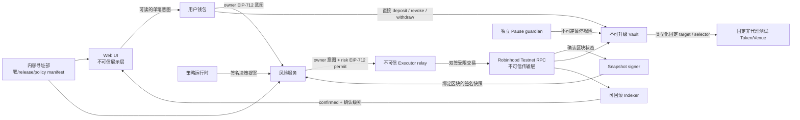

# ADR-0001：测试网 MVP 范围、角色与安全边界

- 状态：独立复核中
- 日期：2026-09-06
- 决策任务：`GOV-001`
- 机器可读约束：`planning/security-boundary.json`
- [机器约束附录](0001-security-boundary.generated.md)
- 适用范围：Robinhood Chain Testnet 黑客松 MVP

## 结论

QuantPass v1 采用“协议合约托管、应用与团队非托管”的最小架构：测试资产可以进入用户主动选择的不可升级 Vault 合约，但浏览器、服务端、策略运行时、风险签名者、执行器和项目团队均不得持有用户私钥，也不得获得提取用户资产的权限。

MVP 只允许本地模拟和 Robinhood Chain Testnet（Chain ID `46630`）。执行模式冻结为“每笔意图由用户查看并签名，风险服务再对同一笔意图签发许可，executor 只能转发双签交易”。禁止后台无人值守、连续或自主交易。当前部署写平面和应用写平面都关闭，并且不能靠单个环境变量或隐藏开关启用。

合约 v1 不使用 proxy、`delegatecall`、任意 target 或任意 calldata；只允许 ABI 类型化且在部署时固定的 target/selector 调用。外部目标不得是 proxy 或可变 implementation。出现缺陷时不原地升级：执行不可逆安全暂停，始终保留 owner 的撤销和直接提现路径，部署新地址，并由用户通过钱包主动迁移。

## 为什么这样选择

比赛版本的首要目标是证明权限隔离、会计不变量和可审计执行，而不是覆盖最多协议。不可升级、单资产、固定目标、逐笔用户确认和无异步外部托管的设计缩小攻击面，也让构建哈希、部署参数和评审结论可以稳定复现。

“非托管”在这里不表示资产从不进入合约，而是明确表示：

- 用户私钥只存在于用户钱包；
- 团队服务和执行器不能把 Vault 资产转给自己或任意第三方；
- 用户可以不依赖 QuantPass 前端和后端，直接通过合约撤销授权并退出；
- 合约本身仍承载资产风险，因此在通过合约安全门禁前不得接触真实价值资产。

## 当前基线与目标边界

| 组件              | 当前能力                                | Testnet 目标                    | 禁止的捷径                               |
| ----------------- | --------------------------------------- | ------------------------------- | ---------------------------------------- |
| `localSimulation` | 为本地演示按命令类型选择 owner/executor | 仅保留为本地 mock               | 不得复用其隐式角色提升到 Testnet         |
| 本地账本          | 输入驱动的 deposit、成交、估值和结算    | 仅作差分模型                    | 不得把输入值伪装成链上回执或余额         |
| Ed25519 安全模型  | 本地研究用途                            | 策略 release 可保留链下签名     | 不得将其描述为链上钱包授权               |
| Testnet 授权      | 尚未实现                                | EIP-712、固定信任根、链上 nonce | 不得由请求方传入“可信”公钥或 release     |
| HTTP 会话         | loopback-only demo cookie               | 与 Testnet 身份体系完全隔离     | 不得把 demo 用户名当成钱包身份           |
| RPC 与索引        | 尚无链读取                              | 失败关闭、确认深度、可回滚      | 不得把 pending 或单一 RPC 响应当最终状态 |

这些隔离分别由 `PRIV-001`、`TRUST-001`、`BACKEND-001`、`RPC-001` 和 `INDEX-001` 继续落地。

## 架构与数据流



端到端写入状态机必须是：

`prepare → show → owner sign → validate confirmed snapshot/decision → risk sign → simulate → relay → confirm → reconcile`

任何阶段超时、链身份不一致、字节码不一致、签名缺字段、nonce 冲突、回执失败或重组，都进入明确失败或待确认状态；不得跳过步骤，也不得把 pending 展示为成功。

### 信任边界清单

`TB-01` 至 `TB-09` 的来源、目标、数据和强制控制由 `planning/security-boundary.json` 定义，并自动生成到[机器约束附录](0001-security-boundary.generated.md)。手写 ADR 不复制这些字段，避免两份描述发生静默漂移。

## 角色与能力矩阵

| 角色                                  | 信任凭证                        | 允许能力                                      | 明确禁止                             |
| ------------------------------------- | ------------------------------- | --------------------------------------------- | ------------------------------------ |
| Owner (`owner`)                       | 用户钱包签名                    | 存入/提取测试资产、撤销意图、签署单笔执行意图 | 升级、后台授权、绕过会计             |
| Strategy runtime (`strategy-runtime`) | manifest 固定的 Ed25519 key     | 产生受限决策提案                              | 发交易、持有用户密钥、批准风险       |
| Risk signer (`risk-signer`)           | manifest 固定的独立 EVM key     | 对 owner 已签的同一笔意图签发受限许可         | 发交易、提现、改变调用内容           |
| Snapshot signer (`snapshot-signer`)   | manifest 固定的独立 Ed25519 key | 对确认区块的账户快照签名                      | 签交易、接受 pending 状态、改政策    |
| Executor (`executor`)                 | 不可信低余额 relay 账户         | 转发 owner+risk 双签交易                      | 创造权限、改变 calldata/收款人、提现 |
| Pause guardian (`pause-guardian`)     | immutable 独立 guardian 地址    | 不可逆暂停风险增加动作                        | unpause、提现、阻止 owner 退出       |
| Deployer (`deployer`)                 | 一次性低余额部署账户            | 部署不可升级合约                              | 部署后保留权限、升级、执行策略       |
| Indexer (`indexer`)                   | 无签名 key 的只读 RPC           | 读取确认事件、回滚和对账                      | 签名、发交易、把 pending 宣布为成功  |

强制职责分离如下：

- 只有 owner 可以获得 `withdraw_test_asset` 能力；owner 的直接提现不需要 risk signer 或 executor；
- owner 先签可读的单笔意图，risk signer 只能对同一 commitment 签许可，executor 只能 relay；三者不能互相替代；
- pause guardian 只能降低风险，不能移动资产；
- deployer 完成一次性配置后不拥有升级或提款后门；
- indexer 的展示状态没有链上授权效果。

Risk signer、snapshot signer、executor、pause guardian 和 deployer 的地址必须非零且两两不同。比赛演示可以由同一位自然人操作多个专用测试账户，但地址、密钥材料和软件权限仍必须分开，且不得因此合并合约角色。

v1 不提供原地角色轮换或 unpause。特权 key 丢失、泄露或需更换时，流程固定为：不可逆暂停 → owner 退出 → 发布新 manifest/新合约 → owner 明确重新授权。这样避免引入一个可静默改变信任根的超级管理员。

## 资产决策

每个 Vault 最多支持一个在部署时固定的 ERC-20 测试资产。当前 active allowlist 为空，`ASSET-001` 完成前没有任何可写入 Testnet 的资产。候选资产只允许项目部署、固定供应、名称和符号均明确标记测试用途的 token；预分配 faucet 只能向用户转移已有供应，不能 mint 到 Vault。不得冒充 USDT、USDC 或任何正式资产。

资产进入 allowlist 前必须验证并固定：

- Chain ID、合约地址、runtime bytecode hash 和 decimals；
- ERC-20 返回值处理；
- deposit 核对 Vault 实际余额差；`received != requested` 时整笔回滚，而不是接受差额；
- 合约对外授权使用精确金额，用后清零；
- 部署清单与 UI 使用同一份资产元数据。

MVP 无条件拒绝 fee-on-transfer、rebasing、ERC-777/回调 hook、未知或可变化 decimals、未核验字节码、隐藏转账税、proxy/可变 implementation，以及任何可对 Vault 增发、没收、拉黑或 burn 的管理员能力。遇到异常资产行为必须回滚交易或关闭入口，不能用 UI 补偿账目。

## 签名、信任根与秘密

链上执行采用两份独立签名：owner 的单笔 EIP-712 intent，以及 risk signer 对同一 `ownerIntentHash` 签发的 EIP-712 permit。两者都绑定 `chainId`、`verifyingContract`、Vault、owner、asset、target、selector、`calldataHash`、value、输入金额、最小输出、独立 nonce、deadline 和 `policyHash`；risk permit 还绑定策略决策与账户快照 commitment。owner nonce 与 risk nonce 在合约中使用独立命名空间并原子消费，trade permit 永远不能授权提现。

策略决策使用 manifest 固定的 runtime key，并绑定 release、policy、账户快照 commitment、目标意图 hash、时效和由风险服务持久消费的 nonce。账户快照由独立 snapshot signer 签名并绑定 block number、block hash、owner、Vault、Chain ID 与余额/仓位 commitment。信任根来自内容寻址 manifest，不得由同一个 API 请求连同待验证内容一起传入。

秘密边界：

| 秘密                  | 唯一持有位置               | 禁止位置                                        |
| --------------------- | -------------------------- | ----------------------------------------------- |
| 用户私钥              | 用户钱包                   | 仓库、服务端、浏览器存储、日志、CI              |
| Strategy runtime 私钥 | 隔离 runtime key provider  | 仓库、服务端文件、明文 `.env`、浏览器、日志、CI |
| Risk signer 私钥      | 硬件或托管密钥提供方       | 仓库、明文 `.env`、浏览器、日志、CI             |
| Snapshot signer 私钥  | 独立托管密钥提供方         | 仓库、服务端文件、明文 `.env`、浏览器、日志、CI |
| Executor 私钥         | 独立低余额钱包或密钥提供方 | 仓库、明文 `.env`、浏览器、日志、CI             |
| Deployer 私钥         | 硬件钱包或密钥提供方       | 仓库、明文 `.env`、浏览器、日志、CI             |
| Pause guardian 私钥   | 独立 guardian 钱包         | 仓库、明文 `.env`、浏览器、日志、CI             |

当前 `.env.example` 只能包含公开网络元数据。任何要求把裸私钥放入环境文件的实现都不满足本 ADR。

## 暂停、安全退出与迁移

暂停对当前地址不可逆，阻止新存入、新执行意图和新外部调用；不存在 unpause。暂停时 owner 仍可不依赖服务端直接撤销待处理意图和提取测试资产。

MVP 禁止异步外部托管、挂单或需要第三方后续结算的仓位。任何允许的 Venue 调用必须在同一交易中原子完成，结束时资产回到 Vault；否则交易回滚。这样 owner 的退出不依赖 executor、guardian 或 Venue 的后续配合。

不可升级合约的迁移流程：

1. Guardian 暂停风险增加入口；
2. Indexer 固定受影响地址、区块和状态快照；
3. 用户通过旧 Vault 直接撤销和提现；
4. 团队发布新合约的源码、构建参数、bytecode hash 和风险说明；
5. 用户显式选择是否把退出后的测试资产存入新地址；
6. UI 和 adapter 永久停用旧地址的新操作，但保留只读状态和退出入口。

不存在管理员批量迁移用户余额、代理升级或静默换地址。

## 明确禁止项

- 主网、未知网络和真实价值资产；
- 应用持有用户助记词或私钥；
- 隐式、自动或不可读的钱包签名；
- 任意 target、任意 calldata、`delegatecall`、proxy 升级和无限 allowance；
- executor、guardian、deployer 或团队管理员提现，或把资产发送到任意收款人；类型化固定 Venue 的原子执行不属于任意转账；
- 调用方自带公钥、release 或账户快照并将其声明为信任根；
- 仅内存 nonce、防重放或幂等记录；
- 把 pending 交易、单节点响应或未确认日志展示为成功；
- 将 `localSimulation` 的自动角色选择逻辑接入 Testnet；
- 无人值守、自主、批量或后台连续交易；每笔意图必须单独由用户确认；
- 异步外部托管、pending position、管理员批量迁移或静默换地址；
- 用“测试网”标签掩盖未实现、模拟或用户输入驱动的数据。

## 两个 Testnet 写平面

本 ADR 不开启任何 Testnet 写平面。部署写入和应用资产写入必须分开审核，避免“必须先部署才能允许部署”的循环。

- 部署写平面：仅用于人工一次性部署。完成 G1/G2、威胁模型、配置/资产/信任规格、合约实现与测试、安全复核、密钥手册和 dry-run 后，才可临时开放；`DEPLOY-001` 不是它自己的前置条件。
- 应用写平面：部署完成并通过 `VERIFY-001` 后，还必须完成 `PRIV-001`、钱包、adapter、交易恢复、indexer、RPC、前端安全、监控和事故演练，并通过 G3，才可由显式 feature flag 开启。

两个写平面都必须实时核对配置、钱包与 RPC 的 Chain ID `46630`，并核验 Vault、资产、Venue 的非空 code、非 proxy 属性和 runtime hash。任意证据缺失时失败关闭，回退到只读或本地模拟。

## 可复核证据

运行以下命令检查机器约束和文档同步：

```bash
npm run governance:check
npm test
npm run planning:check
```

复核者应能仅通过本 ADR 和 `planning/security-boundary.json` 回答：谁能提取资产、谁能暂停、每把私钥位于何处、哪些签名绑定哪些字段、支持什么资产、哪些动作在暂停时仍可执行，以及出现漏洞时如何退出和迁移。

本记录是架构范围决策，不是合约审计或 Testnet 上线批准。后续任务若改变任何角色、资产、签名、退出或升级边界，必须新增 ADR、更新机器约束并重新通过评审，不能静默修改本文件。
