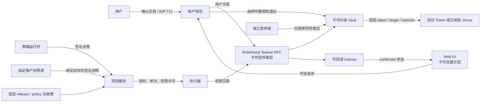

# ADR-0001：测试网 MVP 范围、角色与安全边界

- 状态：已接受
- 日期：2026-09-06
- 决策任务：`GOV-001`
- 机器可读约束：`planning/security-boundary.json`
- 适用范围：Robinhood Chain Testnet 黑客松 MVP

## 结论

QuantPass v1 采用“协议合约托管、应用与团队非托管”的最小架构：测试资产可以进入用户主动选择的不可升级 Vault 合约，但浏览器、服务端、策略运行时、风险签名者、执行器和项目团队均不得持有用户私钥，也不得获得提取用户资产的权限。

MVP 只允许本地模拟和 Robinhood Chain Testnet（Chain ID `46630`）。当前 Testnet 写入保持关闭；只有 `G1`、`G2` 以及机器约束中列出的前置任务完成后，才能由独立 adapter 显式开启。主网、真实价值资产和自动交易不属于本项目范围，并且不能靠单个环境变量或隐藏开关启用。

合约 v1 不使用 proxy、`delegatecall` 或任意外部调用。出现缺陷时不原地升级：暂停增加风险的入口，始终保留 owner 的撤销和退出路径，部署新地址，并由用户主动迁移。

## 为什么这样选择

比赛版本的首要目标是证明权限隔离、会计不变量和可审计执行，而不是覆盖最多协议。不可升级、单资产、固定目标的设计缩小攻击面，也让构建哈希、部署参数和评审结论可以稳定复现。

“非托管”在这里不表示资产从不进入合约，而是明确表示：

- 用户私钥只存在于用户钱包；
- 团队服务和执行器不能把 Vault 资产转给自己或任意第三方；
- 用户可以不依赖 QuantPass 前端和后端，直接通过合约撤销授权并退出；
- 合约本身仍承载资产风险，因此在通过合约安全门禁前不得接触真实价值资产。

## 当前基线与目标边界

| 组件 | 当前能力 | Testnet 目标 | 禁止的捷径 |
| --- | --- | --- | --- |
| `localSimulation` | 为本地演示按命令类型选择 owner/executor | 仅保留为本地 mock | 不得复用其隐式角色提升到 Testnet |
| 本地账本 | 输入驱动的 deposit、成交、估值和结算 | 仅作差分模型 | 不得把输入值伪装成链上回执或余额 |
| Ed25519 安全模型 | 本地研究用途 | 策略 release 可保留链下签名 | 不得将其描述为链上钱包授权 |
| Testnet 授权 | 尚未实现 | EIP-712、固定信任根、链上 nonce | 不得由请求方传入“可信”公钥或 release |
| HTTP 会话 | loopback-only demo cookie | 与 Testnet 身份体系完全隔离 | 不得把 demo 用户名当成钱包身份 |
| RPC 与索引 | 尚无链读取 | 失败关闭、确认深度、可回滚 | 不得把 pending 或单一 RPC 响应当最终状态 |

这些隔离分别由 `PRIV-001`、`TRUST-001`、`BACKEND-001`、`RPC-001` 和 `INDEX-001` 继续落地。

## 架构与数据流



端到端写入状态机必须是：

`prepare → validate → simulate → user/risk sign → submit → confirm → reconcile`

任何阶段超时、链身份不一致、字节码不一致、签名缺字段、nonce 冲突、回执失败或重组，都进入明确失败或待确认状态；不得跳过步骤，也不得把 pending 展示为成功。

### 信任边界清单

| ID | 边界 | 必须执行的检查 |
| --- | --- | --- |
| `TB-01` | Web UI → 用户钱包 | 显示并核对链、合约、资产、金额、截止时间和权限，拒绝静默签名 |
| `TB-02` | 策略运行时 → 风险服务 | 验证固定 release、策略哈希、时效和账户快照；运行时只有提案权 |
| `TB-03` | 风险服务 → Executor | 许可必须短时、单次并绑定完整链域、calldata、金额、滑点和政策 |
| `TB-04` | Executor → Vault | 合约独立校验角色、nonce、许可、目标、selector、资产和限额 |
| `TB-05` | RPC → Adapter/Indexer | RPC 按不可信输入处理；核对 chainId、bytecode、确认深度和 block hash |
| `TB-06` | Vault → Token/Venue | 仅固定地址和 selector，使用余额差、精确授权、返回值检查和重入保护 |
| `TB-07` | 已确认链事件 → UI | 按 chainId/txHash/logIndex 去重；pending 不算成功，重组必须回滚 |

## 角色与能力矩阵

| 角色 | 信任凭证 | 允许能力 | 明确禁止 |
| --- | --- | --- | --- |
| Owner (`owner`) | 用户钱包签名 | 存入测试资产、额度内分配、停止、撤销、退出 | 升级合约、绕过会计 |
| Strategy runtime (`strategy-runtime`) | 已登记 release 签名 | 产生受限决策提案 | 发交易、持有用户密钥、提现、改政策 |
| Risk signer (`risk-signer`) | 独立密钥提供方 | 对通过校验的单次许可签名 | 发交易、提现、修改 allowlist |
| Executor (`executor`) | 独立低余额密钥 | 提交已签名、allowlist 内的受限执行 | 提现、转账、改 owner/政策/角色、暂停、升级 |
| Pause guardian (`pause-guardian`) | 与部署者/执行器分离的密钥 | 暂停增加风险的动作 | 提现、转账、阻止 owner 退出、升级 |
| Deployer (`deployer`) | 独立低余额部署密钥 | 部署不可升级合约、一次性初始化和提名 guardian | 提现、改变 immutable 参数、执行策略 |
| Indexer (`indexer`) | 只读 RPC | 读取确认事件、回滚和对账 | 签名、发交易、把 pending 宣布为成功 |

强制职责分离如下：

- 只有 owner 可以获得 `withdraw_assets` 能力；
- risk signer 只签许可，executor 只提交许可，二者不能互相替代；
- pause guardian 只能降低风险，不能移动资产；
- deployer 完成一次性配置后不拥有升级或提款后门；
- indexer 的展示状态没有链上授权效果。

比赛演示可以由同一位自然人操作多个专用测试账户，但地址、密钥材料和软件权限仍必须分开，且不得因此合并合约角色。

## 资产决策

每个 Vault 只支持一个在部署时固定的 ERC-20 测试资产。`ASSET-001` 完成前，允许资产集合为空，Testnet 写入保持关闭。若没有权威测试资产，则部署名称和符号都明确标记为测试用途的项目 mock token；不得冒充 USDT、USDC 或任何正式资产。

资产进入 allowlist 前必须验证并固定：

- Chain ID、合约地址、runtime bytecode hash 和 decimals；
- ERC-20 返回值处理；
- deposit 按 Vault 实际余额差记账，而不是相信调用参数；
- 合约对外授权使用精确金额，用后清零；
- 部署清单与 UI 使用同一份资产元数据。

MVP 拒绝 fee-on-transfer、rebasing、ERC-777/回调 hook、未知或可变化 decimals、未核验字节码、隐藏转账税，以及项目 mock 之外带管理员增发/没收能力的资产。遇到异常资产行为必须回滚交易或关闭入口，不能用 UI 补偿账目。

## 签名、信任根与秘密

链上 owner 授权使用 EIP-712，并至少绑定：`chainId`、`verifyingContract`、Vault、owner、executor、asset、target、`calldataHash`、value、nonce、deadline、`policyHash` 和滑点上限。nonce 必须由合约原子消费。

策略 release 和账户快照的信任根来自固定注册表或指定来源，不得由同一个 API 请求连同待验证内容一起传入。账户快照必须绑定 block number、block hash、owner、Vault 和 Chain ID。

秘密边界：

| 秘密 | 唯一持有位置 | 禁止位置 |
| --- | --- | --- |
| 用户私钥 | 用户钱包 | 仓库、服务端、浏览器存储、日志、CI |
| Risk signer 私钥 | 硬件或托管密钥提供方 | 仓库、明文 `.env`、浏览器、日志、CI |
| Executor 私钥 | 独立低余额钱包或密钥提供方 | 仓库、明文 `.env`、浏览器、日志、CI |
| Deployer 私钥 | 硬件钱包或密钥提供方 | 仓库、明文 `.env`、浏览器、日志、CI |
| Pause guardian 私钥 | 独立 guardian 钱包 | 仓库、明文 `.env`、浏览器、日志、CI |

当前 `.env.example` 只能包含公开网络元数据。任何要求把裸私钥放入环境文件的实现都不满足本 ADR。

## 暂停、安全退出与迁移

暂停时阻止：新存入、新分配、启动策略和创建新订单。暂停时仍允许：停止策略、取消待处理意图、去分配、结算既有仓位、提取 idle 资产和撤销 executor 许可。

若外部 venue 导致已有仓位无法立即退出，合约必须有文档化的 timeout/fallback，且不得允许 executor 或 guardian 接管资产。具体退出状态机在合约规格中冻结并由 invariant 测试证明。

不可升级合约的迁移流程：

1. Guardian 暂停风险增加入口；
2. Indexer 固定受影响地址、区块和状态快照；
3. 用户通过旧 Vault 直接撤销、结算和提现；
4. 团队发布新合约的源码、构建参数、bytecode hash 和风险说明；
5. 用户显式选择是否把退出后的测试资产存入新地址；
6. UI 和 adapter 永久停用旧地址的新操作，但保留只读状态和退出入口。

不存在管理员批量迁移用户余额、代理升级或静默换地址。

## 明确禁止项

- 主网、未知网络和真实价值资产；
- 应用持有用户助记词或私钥；
- 隐式、自动或不可读的钱包签名；
- 任意 `call`、`delegatecall`、proxy 升级和无限 allowance；
- executor、guardian、deployer 或团队管理员提现/转账；
- 调用方自带公钥、release 或账户快照并将其声明为信任根；
- 仅内存 nonce、防重放或幂等记录；
- 把 pending 交易、单节点响应或未确认日志展示为成功；
- 将 `localSimulation` 的自动角色选择逻辑接入 Testnet；
- 用“测试网”标签掩盖未实现、模拟或用户输入驱动的数据。

## Testnet 写入启用条件

本 ADR 不开启 Testnet 写入。必须同时满足：

- `G1` 设计冻结和 `G2` 安全验证通过；
- `THREAT-001`、`CONFIG-001`、`ASSET-001`、`SEC-002`、`KEY-001`、`DEPLOY-001` 完成；
- 配置、钱包和实时 RPC 三方确认 Chain ID `46630`；
- Vault、资产和外部目标地址存在非空且匹配清单的 runtime bytecode；
- 用户在可读界面中显式确认测试网、地址、资产、金额和风险；
- 任意证据缺失时 adapter 失败关闭并回退到只读或本地模拟。

## 可复核证据

运行以下命令检查机器约束和文档同步：

```bash
npm run governance:check
npm test
npm run planning:check
```

复核者应能仅通过本 ADR 和 `planning/security-boundary.json` 回答：谁能提取资产、谁能暂停、每把私钥位于何处、哪些签名绑定哪些字段、支持什么资产、哪些动作在暂停时仍可执行，以及出现漏洞时如何退出和迁移。

本记录是架构范围决策，不是合约审计或 Testnet 上线批准。后续任务若改变任何角色、资产、签名、退出或升级边界，必须新增 ADR、更新机器约束并重新通过评审，不能静默修改本文件。
